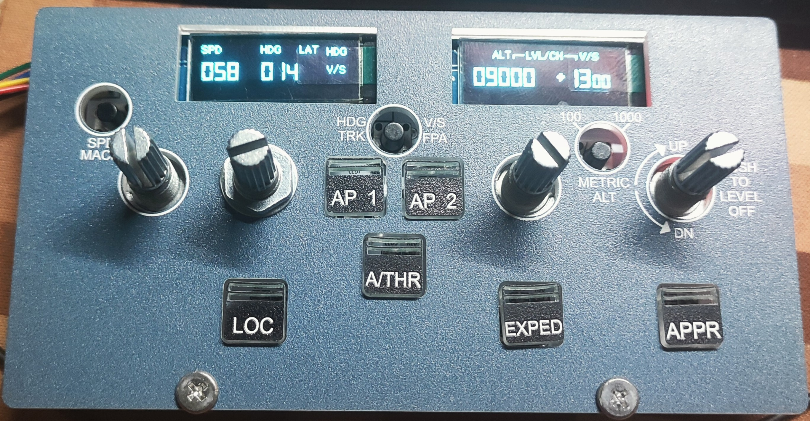
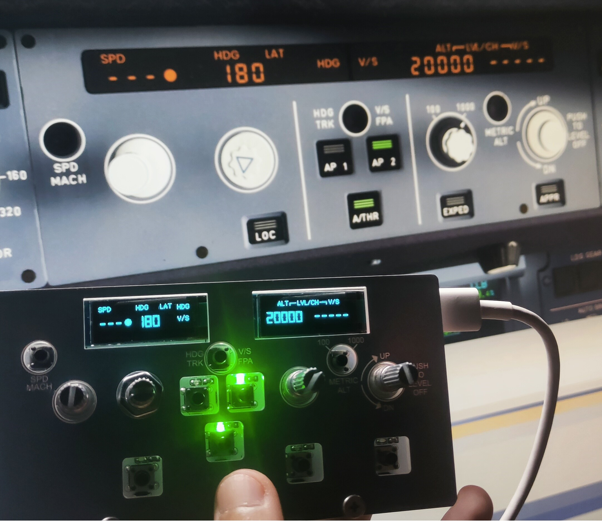

# 模拟飞行外设 FCU Panel

## 特点
- 使用合宙AIR32F103CCT6作为芯片全新价格3.8包邮，移植手册较为全面
- PCB和面板都可以白嫖，面板的设计春春新手还在改进，第一版暂时能用
- 软件仅仅适配了FBW A32NX机模的FCU面板
## 原理
- 上位机软件连接 Simconnect，读取数据和发送按钮事件给游戏，使用vs2022 社区版+cpp编写 
外设与上位机的通信使用hidapi
- 下位机完成2个0.91寸OLED的显示和按钮的扫描、LED的亮灭
## 存在问题
- 有一定延迟
- 上位机的数据刷新通过游戏模拟帧，再发送数据到外设更新显示存在体感延迟，暂时没有改进的idea，欢迎大家帮忙
- hid通信的时候会吞掉第一个字节（好像是report id，但是目前也只有一个output 节点，不知道可不可以不加）也没有找到哪里可以修改，笨办法: 增加一个无效字节下位机代码描述接收13个字节，当时卡了半天
- 硬件I2C DMA刷新oled的问题，可能是判断DMA I2C传输完成标志的方法不对，使用DMA的时候怎么都调试不同，恳请各位大佬指教
## 未来计划2.0版本
- 尝试使用老王家的长条128x32的屏幕，可能仿真度会更高
- 修改面板试试看能不能只透过黄光
- 增加一个蜂鸣器发出自动驾驶断开提示音榨干最后一个引脚
- 优化PCB布线绕开螺丝固定位置
- 修改面板打印，添加320样式旋钮表面图的打印（那个花纹三角形之类的）

## BOM
- Air32F103CC 替换STM32F103
- 轻触开关 6*6*8H，高度可以自行调整，EC11上有螺纹可以自行使用螺母
- LED限流电阻可以更大一点，限制亮度。我打样的面板按钮是镂空的非透明控制，感觉还是有点亮。
- 晶振使用的是12MHz 3225无源晶振

## 踩过的坑
- USB设备DP线一定要注意拉高，因为这个问题当时卡了2天没有调试通
- 接收数据第一个字节丢失（未解决，绕开）

## Host
https://github.com/Diaosi1111/FlightHIDComm
 
## Hardware
https://oshwhub.com/zsws/FCU-Panel